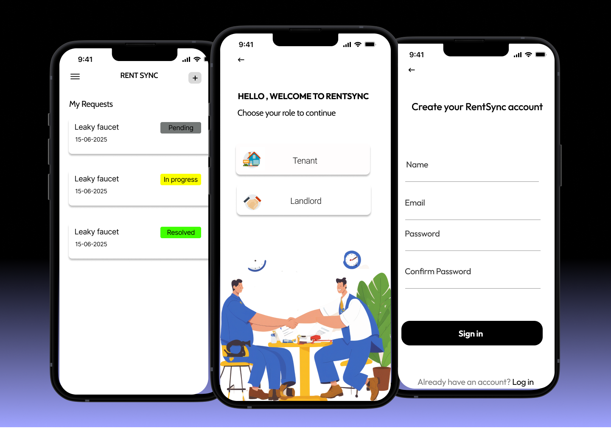

# Rent Sync

Rent Sync is a powerful and user-friendly Flutter-based mobile application designed to streamline the communication between tenants and landlords, specifically focusing on managing service and repair requests with efficiency and transparency. 

---

## Features

- Tenant and Landlord sign-up and login (Firebase Auth)  
- Tenants can submit and track service requests  
- Landlords can view and manage requests  
- Real-time updates with Firestore  
- Profile image upload via Firebase Storage  
- Supports Android and Web platforms  

---

## Screenshots / Demo

*(Add your app screenshots here)*  
  

---

## Getting Started

### Prerequisites

- Flutter SDK installed  
- Firebase project with Auth and Firestore configured  

### Installation

1. Clone the repository:  
   ```bash
   git clone https://github.com/yourusername/rent_sync.git
   cd rent_sync
